# BD: Trabalho Prático APF-T

**Grupo**: P10G7

- Miguel Vila, MEC: 107276
- Miguel Reis, MEC: 108545

## Instruções de Execução (Development)

Pode alterar as credenciais de acesso à base de dados na class `Database` no projeto `BUD` que se encontra dentro da pasta `ui` modificando as variáveis `serverAddress`, `databaseName`, `databaseUsername` e `databasePassword`.

[Ficheiro Database](./ui/BUD/Entities/Database.cs "Database.cs")

### Utilizadores de Teste

Email: `jas@ua.pt` Password: `jas123` (Utilizador Normal com role de estudante e professor)

Email: `cgp@ua.pt` Password: `cgp123` (Utilizador com role de Staff)

## Introdução

O nosso trabalho é baseado num _ticketing system_ da Universidade de Aveiro para comunicação com os STIC (Serviços de Tecnologia Informação e Comunicação). Este sistema é utilizado para requisição de operações sobre os serviços da responsabilidade dos STIC, reportar problemas nesses mesmos serviços e, dessa forma, permitir uma melhor comunicação entre a comunidade académica e os STIC.

O sistema permite a criação de tickets, a visualização de detalhes dos tickets, a atualização do estado dos tickets, o acesso aos tickets do utilizador, a troca de mensagens com ou sem anexos entre utilizadores e a gestão de todos os tickets criados por parte dos utilizadores dos STIC. É possível também ver estatísticas sobre os tickets, ver artigos de ajuda sobre os serviços e ver o próprio perfil de utilizador para trocar a foto de perfil.

## ​Análise de Requisitos

- Criação de tickets;
- Visualização dos detalhes de um ticket em específico;
- Modificar o estado do ticket e a sua prioridade;
- Visualizar todos os tickets do sistema;
- Permitir a troca de mensagens com ou sem anexos;
- Ver artigos de ajuda;

## DER - Diagrama Entidade Relacionamento

### Versão final

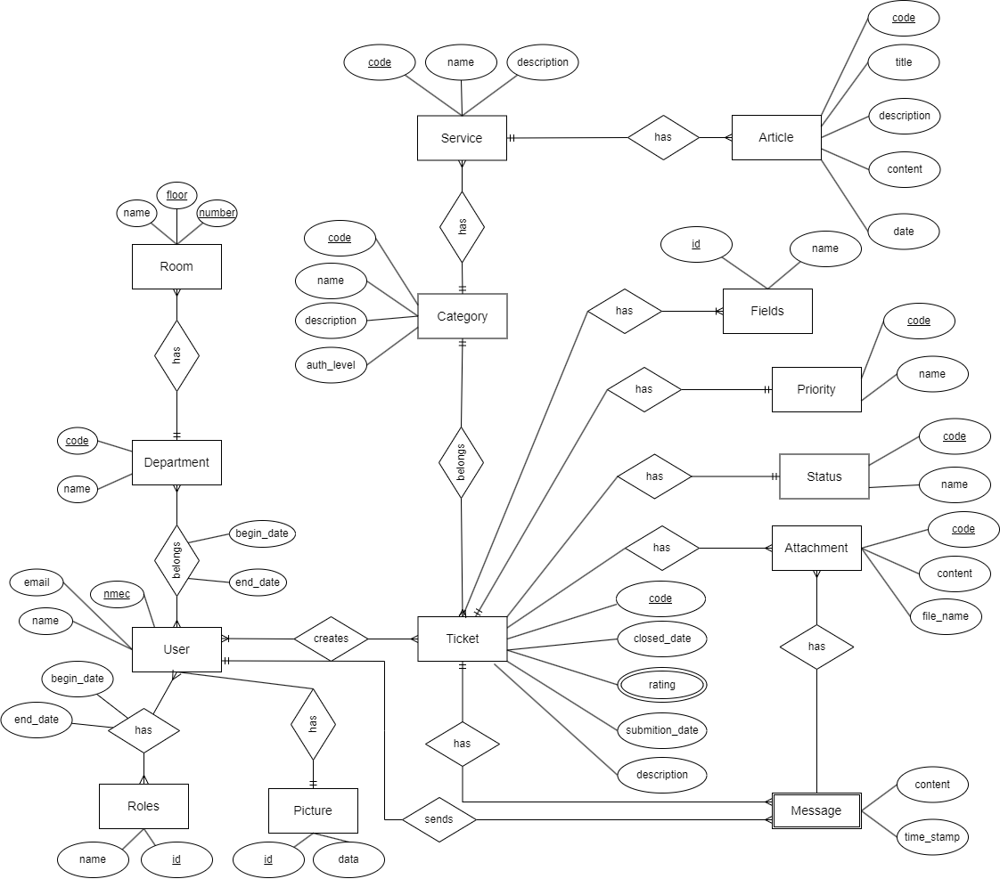

### APFE

Em comparação à primeira entrega, adicionámos a entidade **Picture** para podermos guardar o id e a imagem de forma a que quando queremos obter as informações do utilizador não termos de carregar a imagem do mesmo sem necessidade.

Adicionámos também a entidade **Roles** para podermos ter diferentes tipos de cargos para um mesmo utilizador, registando a data de inicio e fim de cada cargo. Adicionámos também o registo de data de entrada e saida de um departamento para um utilizador. Assim, permitimos que um utilizador tenha vários cargos e pertença a vários departamentos ao longo do tempo, tendo sempre a informação temporal de quando o fizeram.

Fizemos a alteração para que a **Priority** fosse uma entidade como o **Status** para que seja mais fácil, se for necessário, adicionar mais prioridades ou estados. Basta apenas adicionar um registo na tabela correspondente.

Adicionámos também a entidade **Field** com um id e nome para permitir associar a uma categoria de ticket os fields que são necessários para preencher um ticket. Assim, podemos ter diferentes _fields_ para diferentes categorias de ticket.

## ER - Esquema Relacional

### Versão final


### APFE

Devido à alteração do DER, o esquema relacional também sofreu alterações. Adicionámos a tabela **Picture** para guardar a imagem de cada utilizador. Adicionámos a tabela **Roles** para guardar os diferentes cargos de um utilizador. Adicionámos a tabela **UserRoles** para guardar a relação entre um utilizador e os seus cargos. Adicionámos a tabela **UserDepartments** para guardar a relação entre um utilizador e os departamentos a que pertence.

Adicionámos a tabela **category_field** para guardar quais os fields de uma categoria de um ticket.

O sistema também foi pensado para que, na eventualidade de uma categoria já existente vir a necessitar de mais _fields_ ou de um _field_ ser removido, a informação de _fields_ de um ticket não seja perdida. Assim, criámos a tabela **ticket_field** para guardar os _fields_ preenchidos num ticket.

Na tabela **Message** alterámos a primary key para ser o id usando a propriedade identity, para poder associar a uma mensagem um attachment.

## ​SQL DDL - Data Definition Language

[SQL DDL File](db/01_ddl.sql "SQLFileQuestion")

## SQL DML - Data Manipulation Language

### Authentication Form

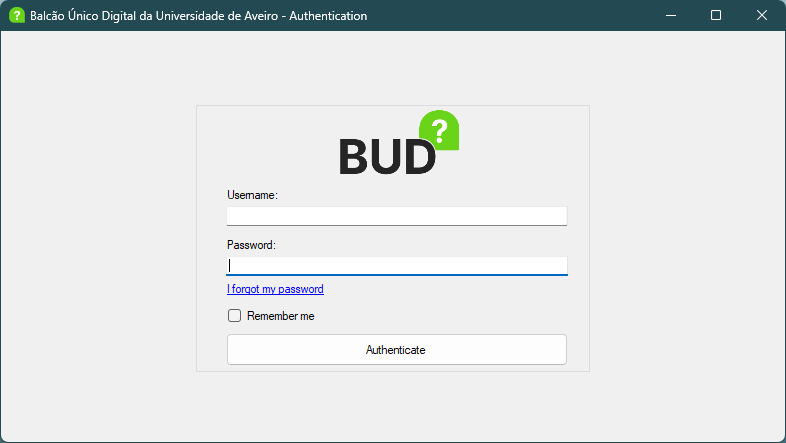

```sql
-- O SP AuthenticateUser devolve o id do utilizador se as credenciais estiverem corretas. Esse id é usado por esta query para obter as informações do utilizador e guardá-las num singleton que faz uso da classe User.

SELECT * FROM BUD.UserInfo WHERE user_id = @UserId
```

### User Profile

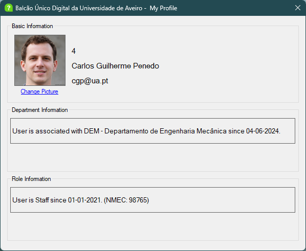

Este é o perfil de um utilizador. Aqui é possível ver os cargos e departamentos a que um utilizador está associado, bem como a data de início e/ou fim dessa associação. É possível também exibir e alterar a imagem de perfil de utilizador através do SP GetUserPicture e SetUserPicture.

Este formulário não faz uso explicito de queries SQL já que a informação é carregada previamente quando o utilizador inicia sessão.

### Dashboard

Este formulário é a página principal do sistema. Contém várias secções, algumas apenas visíveis para utilizadores com o role de "Staff".

#### My Tickets

É uma secção que mostra os tickets do utilizador que está autenticado. É possível ver os detalhes de um ticket clicando na linha do ticket em questão. É possível também filtrar os tickets por categoria, serviço, prioridade e estado.

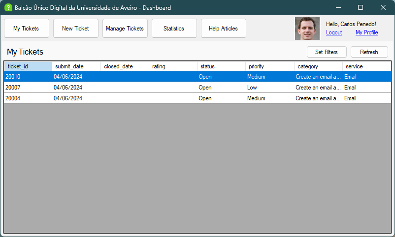

Para mostrar os tickets to utilizador, faz uso do SP SeeUserTickets passando o id do utilizador autenticado e, se definidos, os filtros de categoria, serviço, prioridade e estado.

#### Manage Tickets

É uma secção que está disponível apenas a utilizadores com role "Staff" e mostra todos os tickets do sistema. É possível ver os detalhes de um ticket clicando duas vezes na linha do ticket em questão. É possível também filtrar os tickets por categoria, serviço, prioridade e estado. É possível também eliminar o ticket selecionado.

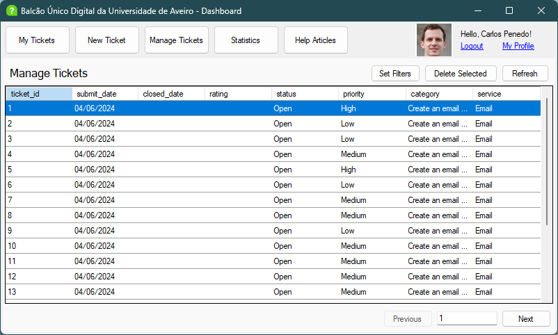

Para mostrar os tickets, faz uso do SP SeeUserTickets não com um id de utilizador mas sim um valor nulo e, se definidos, os filtros de categoria, serviço, prioridade e estado.

Faz também uso de um sistema de paginação para mostrar 20 tickets por cada página já que o número de tickets pode ser muito grande.

#### Statistics

É uma secção que está disponível apenas a utilizadores com role "Staff" e mostra estatísticas generalizadas sobre os tickets do sistema.

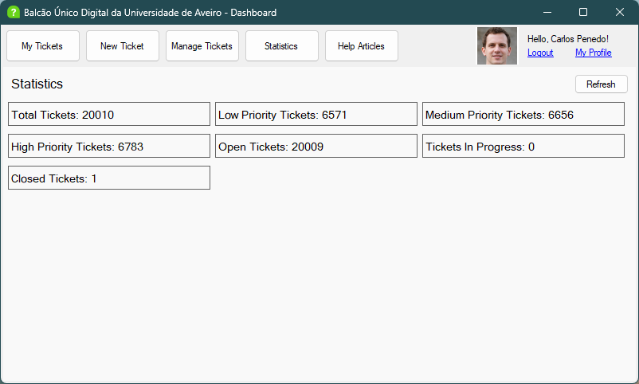

Para mostrar as estatísticas, faz uso das queries SQL:

```sql
-- Total Tickets
SELECT BUD.TotalTickets(NULL) AS TotalTickets

-- Low Priority Tickets
SELECT BUD.TotalTicketsWithPriority(1) AS LowPriorityTickets

-- Medium Priority Tickets
SELECT BUD.TotalTicketsWithPriority(2) AS MediumPriorityTickets

-- High Priority Tickets
SELECT BUD.TotalTicketsWithPriority(3) AS HighPriorityTickets

-- Open Tickets
SELECT BUD.TotalTicketsWithStatus(1) AS OpenTickets

-- Closed Tickets
SELECT BUD.TotalTicketsWithStatus(3) AS ClosedTickets

-- Tickets In Progress
SELECT BUD.TotalTicketsWithStatus(2) AS TicketsInProgress
```

#### Help Articles

É uma secção que mostra artigos de ajuda sobre os serviços disponíveis. É possível pesquisar por um termo de pesquisa para encontrar artigos de ajuda relacionados.

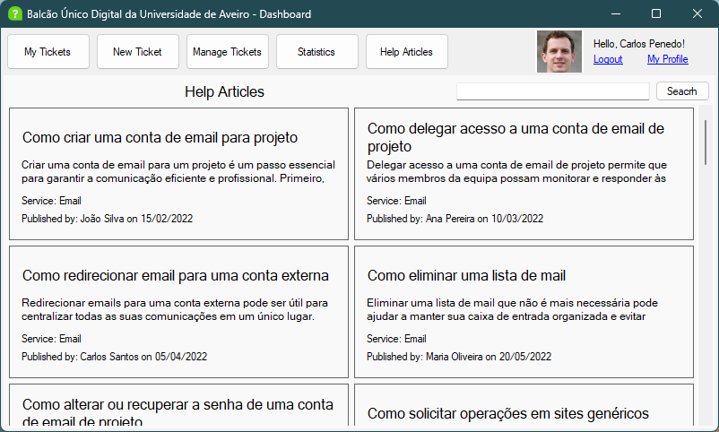

Faz uso da query SQL:

```sql
SELECT 
    a.id, 
    a.title, 
    a.author, 
    a.content, 
    a.[date], 
    a.service_id,
    s.[name] AS service_name
FROM 
    BUD.article a
JOIN 
    BUD.service s ON a.service_id = s.id
WHERE a.title LIKE @searchQuery OR a.content LIKE @searchQuery
```

### Filtering Form

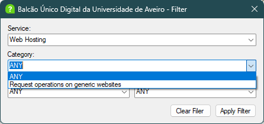

Este formulário é usado para filtrar os tickets por categoria, serviço, prioridade e estado. É interessante notar que o campo categoria é preenchido com base no serviço selecionado. Faz uso das seguintes queries SQL:

```sql
-- Get all services
SELECT id, name FROM BUD.service
-- Get all categories
SELECT id, name FROM BUD.category
-- Get all categories for when a service is selected
SELECT id, name FROM BUD.category WHERE service_id = @ServiceId
-- Get all statuses
SELECT id, name FROM BUD.status
-- Get all priorities
SELECT id, name FROM BUD.priority
```

### Article Viewer

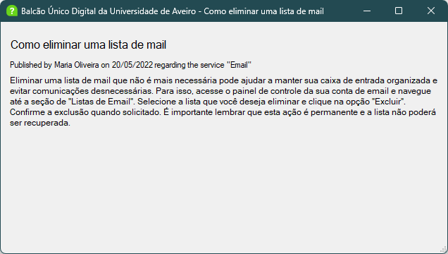

Faz uso da query SQL:

```sql
SELECT
    a.title,
    a.author,
    a.content,
    a.[date],
    s.[name] AS service_name
FROM
    BUD.article a
JOIN
    BUD.service s ON a.service_id = s.id
WHERE
    a.id = @article_id
```

### New Ticket Form

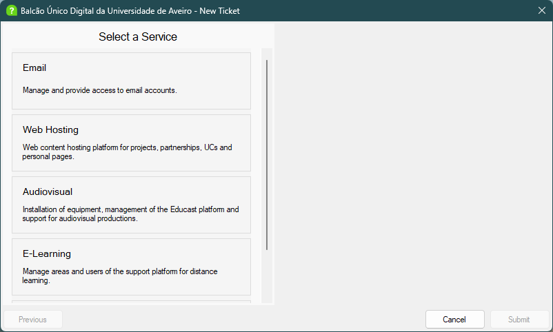


Este formulário é um wizard responsável pela criação de tickets. Desenha de forma dinâmica na UI os serviços, as suas categorias e os campos associados, isto é, para acrescentar um serviço, categoria ou field basta adicionar um registo na base de dados que a UI irá desenhar o formulário automaticamente.

Faz uso da seguinte query SQL para obter os serviços, categorias e fields:

```sql
 SELECT
    service_id, service_name, service_description,
    category_id, category_name, category_description, category_minimum_role,
    field_id, field_name
 FROM
    BUD.ServiceCategoriesFields
 WHERE
    category_minimum_role <= @RoleId
```

A partir do resultado desta query, são instanciados os objetos Service, Category e Field que são usados para desenhar o formulário.

Para submeter o ticket faz uso do SP CreateTicket que recebe os campos preenchidos no formulário e cria um novo ticket.

### Ticket Details / Editor

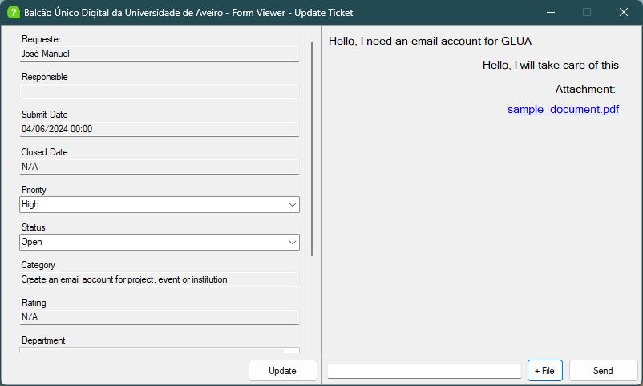

Este formulário é usado para visualizar e, caso o utilizador tenha permissões, editar o estado e prioridade de um ticket.

Faz uso da query SQL:

```sql
-- Recebe os fields comuns a todos os tickets
SELECT
    t.requester_id,
    (SELECT full_name FROM BUD.[user] WHERE id = t.requester_id) AS requester,
    t.responsible_id,
    (SELECT full_name FROM BUD.[user] WHERE id = t.responsible_id) AS responsible,
    t.submit_date,
    t.closed_date,
    t.rating,
    s.[name] AS status,
    p.[name] AS priority,
    c.[name] AS category
FROM
    BUD.ticket t
    JOIN BUD.status s ON t.status_id = s.id
    JOIN BUD.priority p ON t.priority_id = p.id
    JOIN BUD.category c ON t.category_id = c.id
WHERE
    t.id = @ticketId

-- Recebe os fields específicos de um ticket
SELECT
    tf.field_id,
    f.name,
    tf.value
FROM
    BUD.ticket_field tf
    JOIN BUD.field f ON tf.field_id = f.id
WHERE
    tf.ticket_id = @ticketId
```

Neste formulário é possível também trocar mensagens com ou sem anexos. Para enviar uma mensagem faz uso do SP SendMessage que recebe o id do ticket, o id do utilizador que envia a mensagem e o texto da mensagem. Para enviar um anexo faz uso do SP SendAttachmentMessage que recebe o id da mensagem, o nome do ficheiro e o ficheiro em si.

## Normalização

De forma a reduzir a duplicação de dados e reduzir o espaço ocupado, a normalização foi feita até à 3ª forma normal. A normalização foi feita de forma a garantir que cada tabela tem uma chave primária definida, garantindo que cada registo é único. Usamos chaves estrangeiras para permitir referenciar outras tabelas sem duplicar dados. Separámos dados em tabelas diferentes para que dados repetidos não sejam armazenados em várias tabelas.

Consideramos que a normalização até à 3ª forma normal é suficiente para garantir a integridade dos dados e prevenir erros de inserção de dados, pois há uma clara separação das entidades e atributos, as dependências são definidas através de chaves estrangeiras e as tabelas não têm dependências transitivas.

## Índices

```sql
CREATE INDEX IX_ticket_requester_id ON BUD.ticket(requester_id);
```

Melhora o desempenho das consultas que filtram ou ordenam os tickets pelo requester_id, acelerando a pesquisa de tickets e a junção de tabelas.

```sql
CREATE INDEX IX_ticket_priority_id ON BUD.ticket(priority_id);
```

Otimiza a pesquisa de tickets que filtram ou ordenam os tickets pelo priority_id.

```sql
CREATE INDEX IX_ticket_status_id ON BUD.ticket(status_id);
```

Melhora a eficiência das consultas que filtram ou ordenam os tickets pelo status_id.

### Resultados do teste de índices:

[SQL Result File](IndexesTesting.rpt "IndexTest")

## SQL Programming: Stored Procedures, Triggers, UDF

[SQL SPs File](sql/02_sp.sql "StoredProcedures")

[SQL UDFs File](sql/03_udf.sql "UDFs")

[SQL Triggers File](sql/04_triggers.sql "Triggers")

[SQL Indexes File](sql/05_indexes.sql "Indexes")

[SQL Views File](sql/06_views.sql "Views")

## Segurança

Como medidas de segurança, garantimos que cada tabela tem uma chave primária definida, garantindo que cada registo é único. Usamos chaves estrangeiras para garantir a integridade referencial entre as tabelas.

Temos constraints para garantir que os valores inseridos nas tabelas são válidos e não nulos nos casos aplicáveis. No caso do utilizador, a password é guardada como uma hash e com um salt.

Cada campo tem um tipo de dados definido, garantindo integridade dos dados e prevenir erros de inserção de dados.

### Dados iniciais da dabase de dados

[DDL File](sql/01_ddl.sql "DDL")

[DB Init File](sql/07_db_init.sql "DBInit")

### Ficheiros de Teste

[SQL Sample File](sql/08_sample_data.sql "Sample")

[SQL Index Test File](sql/09_test_indexes.sql "IndexTest")

## O que mudou desde a apresentação

Desde a apresentação adicionámos:

- Possibilidade de filtrar os tickets pelas diversas categorias, serviços, prioridades e estados;
- Sistema de paginação na visualização de tickets como "Staff";
- Possibilidade de eliminar tickets como "Staff" e de os reabrir;
- Possibilidade de adicionar anexos às mensagens;
- Visualização de artigos de ajuda;
- Possibilidade de pesquisar com um termo de pesquisa artigos de ajuda;
- Uma página de perfil onde é possível visualizar os cargos e departamentos aos quais um utilizador está associado, bem como a data de início e/ou fim dessa associação;
- Possibilidade de alterar a imagem de perfil de utilizador.

## Vídeo de Demonstração

[Vídeo de Demonstração](./video_demo.mp4 "Demonstração")
