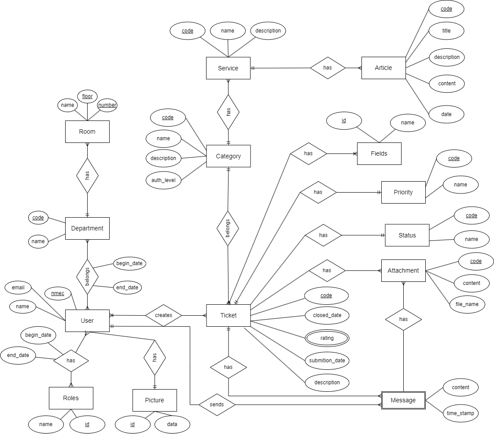
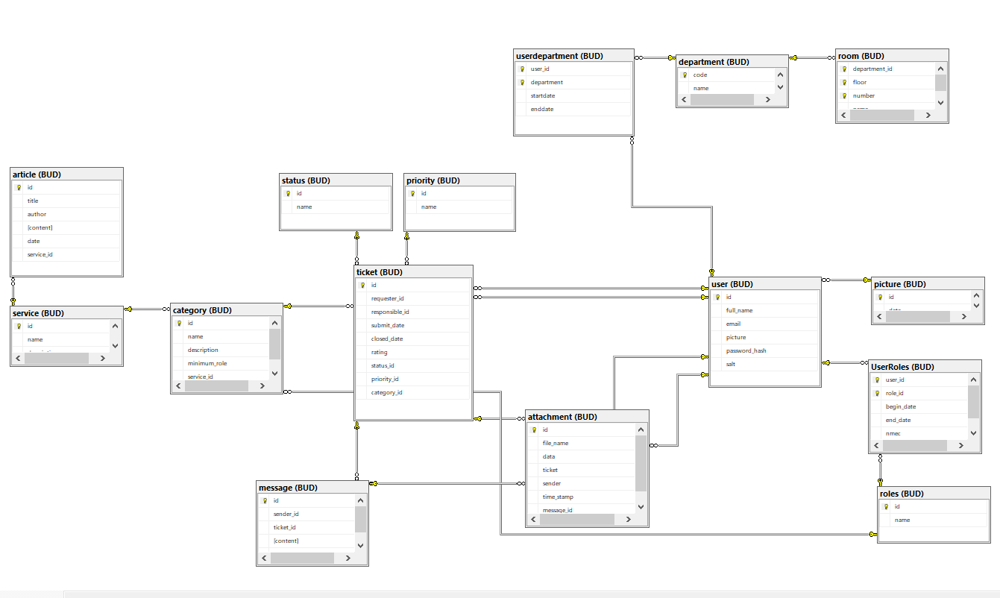

# BD: Trabalho Prático APF-T

**Grupo**: P10G7
- Miguel Vila, MEC: 107276
- Miguel REIS, MEC: 108545

# Instructions - TO REMOVE

Este template é flexível.
É sugerido seguir a estrutura, links de ficheiros e imagens, mas adicione ou remova conteúdo sempre que achar necessário.

---

This template is flexible.
It is suggested to follow the structure, file links and images but add more content where necessary.

The files should be organized with the following nomenclature:

- sql\01_ddl.sql: mandatory for DDL
- sql\02_sp_functions.sql: mandatory for Store Procedure, Functions,... 
- sql\03_triggers.sql: mandatory for triggers
- sql\04_db_init.sql: scripts to init the database (i.e. inserts etc.)
- sql\05_any_other_matter.sql: any other scripts.

Por favor remova esta secção antes de submeter.

Please remove this section before submitting.

## Introdução
 
Escreva uma pequena introdução sobre o trabalho.
Write a simple introduction about your project.

O nosso trabalho é baseado no atual sistema de comunicação da Universidade de Aveiro com os STIC (Serviçoes de Tecnologia Informação e Comunicação)
Este sistema é utilizado para requisição de serviços, reportar problemas e comunicação entre os utilizadores e os STIC. O sistema permite a criação de tickets, a visualização de detalhes dos tickets, a atualização do estado dos tickets, o acesso aos tickets de um utilizador, a troca de mensagens entre utilizadores e a gestão de todos os tickets. É possível também a observação de estatísticas sobre os tickets e observar o nosso perfil de utilizador. Existe também a possibilidade de adicionar anexos às mensagens e observar os artigos de ajuda.
## ​Análise de Requisitos

- Ticket creation
- View ticket details
- Update ticket status
- Access user Tickets
- Messaging
- Manage all tickets


## DER - Diagrama Entidade Relacionamento

### Versão final



### APFE 

Em comparação à primeira entrega, adicionámos a entidade **Picture** para podermos guardar o id e a imagem de forma a que quando queremos obter as informações de utilizador não termos de carregar a imagem de cada utilizador. Adicionámos também a entidade **Roles** para podermos ter diferentes tipos de cargos para um mesmo utilizador, registando a data de inicio e fim de cada cargo. Adicionámos também o registo de data de entrada e saida de um departamento para um utilizador. Permitindo a um utilizador ter vários cargos e pertencer a vários departamentos ao longo do tempo. Fizemos a alteração para que a **Priority** fosse uma entidade como o **Status**.
Adicionámos também a entidade **Field** com um id e nome para guardar os fields preenchidos no ticket.
## ER - Esquema Relacional

### Versão final



### APFE

Devido à alteração do DER, o esquema relacional também sofreu alterações. Adicionámos a tabela **Picture** para guardar a imagem de cada utilizador. Adicionámos a tabela **Roles** para guardar os diferentes cargos de um utilizador. Adicionámos a tabela **UserRoles** para guardar a relação entre um utilizador e os seus cargos. Adicionámos a tabela **UserDepartments** para guardar a relação entre um utilizador e os departamentos a que pertence. Adicionámos a tabela **category_field** para guardar quais os fields de uma categoria de um ticket. Adicionámos a tabela **ticket_field** para guardar os fields preenchidos num ticket. Na tabela **Message** alterámos a primary key para ser o id usando a propriedade identity, para poder associar a uma mensagem um attachment.

## ​SQL DDL - Data Definition Language

[SQL DDL File](db/01_ddl.sql "SQLFileQuestion")


// TODO
## SQL DML - Data Manipulation Language

Uma secção por formulário.
A section for each form.

### Formulario exemplo


```sql
-- Show data on the form
SELECT * FROM MY_TABLE ....;

-- Insert new element
INSERT INTO MY_TABLE ....;
```

...

## Normalização

Descreva os passos utilizados para minimizar a duplicação de dados / redução de espaço.
Justifique as opções tomadas.
Describe the steps used to minimize data duplication / space reduction.
Justify the choices made.

De forma a reduzir a duplicação de dados e reduzir o espaço ocupado, a normalização foi feita até à 3ª forma normal. A normalização foi feita de forma a garantir que cada tabela tem uma chave primária definida, garantindo que cada registo é único. Usamos chaves estrangeiras para permitir referenciar outras tabelas sem duplicar dados. Separámos dados em tabelas diferentes para que dados repetidos não sejam armazenados em várias tabelas.
Consideramos que a normalização até à 3ª forma normal é suficiente para garantir a integridade dos dados e prevenir erros de inserção de dados., pois há uma clara separação das entidades e atributos, as dependências são definidas através de chaves estrangeiras e as tabelas não têm dependências transitivas.

## Índices

Descreva os indices criados. Junte uma cópia do SQL de criação do indice.
Describe the indexes created. Attach a copy of the SQL to create the index.


```sql
CREATE INDEX IX_ticket_requester_id ON BUD.ticket(requester_id);
```
Melhora a eficiência das consultas que filtram ou ordenam os tickets pelo requester_id, acelerando a pesquisa de tickets e a junção de tabelas.

```sql
CREATE INDEX IX_ticket_priority_id ON BUD.ticket(priority_id);
```
Otimiza a pesquisa de tickets que filtram ou ordenam os tickets pelo priority_id.

```sql
CREATE INDEX IX_ticket_status_id ON BUD.ticket(status_id);
```
Melhora a eficiência das consultas que filtram ou ordenam os tickets pelo status_id.

### Resultados do teste de índices:

[SQL Result File](IndexesTesting.rpt "IndexTest")


## SQL Programming: Stored Procedures, Triggers, UDF

[SQL SPs File](sql/02_sp.sql "StoredProcedures")

[SQL UDFs File](sql/03_udf.sql "UDFs")

[SQL Triggers File](sql/04_triggers.sql "Triggers")

[SQL Indexes File](sql/05_indexes.sql "Indexes")

[SQL Views File](sql/06_views.sql "Views")


## Segurança

Como medidas de segurança, garantimos que cada tabela tem uma chave primária definida, garantindo que cada registo é único. Usamos chaves estrangeiras para garantir a integridade referencial entre as tabelas. Temos constraints para garantir que os valores inseridos nas tabelas são válidos e não nulos nos casos aplicáveis. No caso do utilizador, a password é guardada como uma hash e com um salt.
Cada campo tem um tipo de dados definido, garantindo integridade dos dados e prevenir erros de inserção de dados.

### Dados iniciais da dabase de dados

[DDL File](sql/01_ddl.sql "DDL")

[DB Init File](sql/07_db_init.sql "DBInit")

### Ficheiros de Teste

[SQL Sample File](sql/08_sample_data.sql "Sample")

[SQL Index Test File](sql/09_test_indexes.sql "IndexTest")

## O que mudou desde a apresentação

Adicionámos:

- Possibilidade de filtrar os tickets pelas diversas categorias, serviços, prioridades e estados;
- Sistema de paginação na visualização de tickets como "Staff";
- Possibilidade de eliminar tickets como "Staff" e de os reabrir;
- Possibilidade de adicionar anexos às mensagens;
- Visualização de artigos de ajuda;
- Possibilidade de pesquisar com um termo de pesquisa artigos de ajuda;
- Uma página de perfil onde é possível visualizar os cargos e departamentos aos quais um utilizador está associado, bem como a data de início e/ou fim dessa associação;
- Possibilidade de alterar a imagem de perfil de utilizador.

## Vídeo de Apresentação

[]("Video de Apresentação")